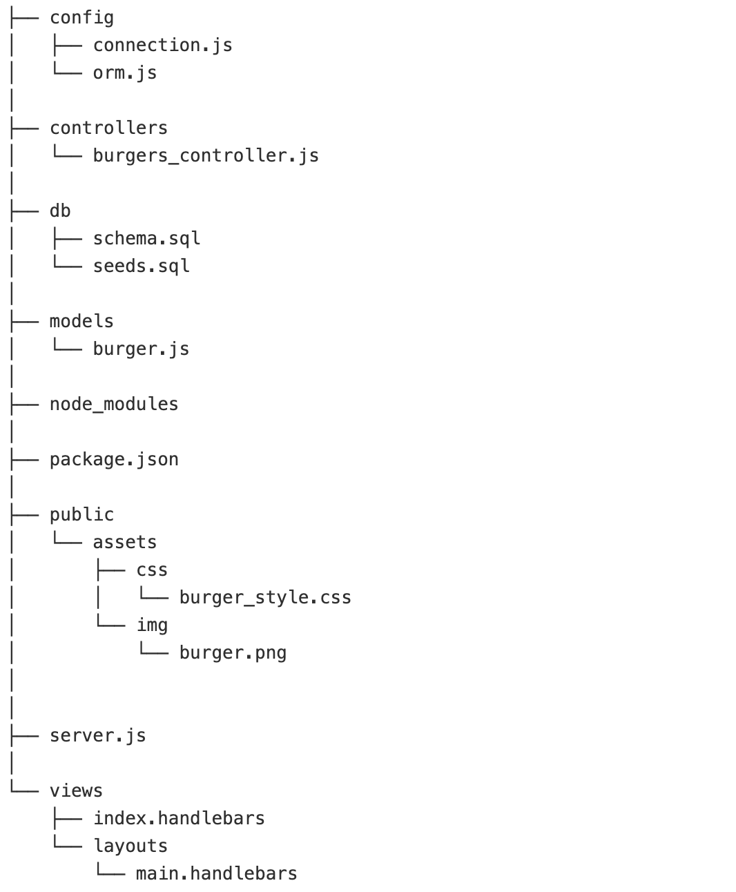
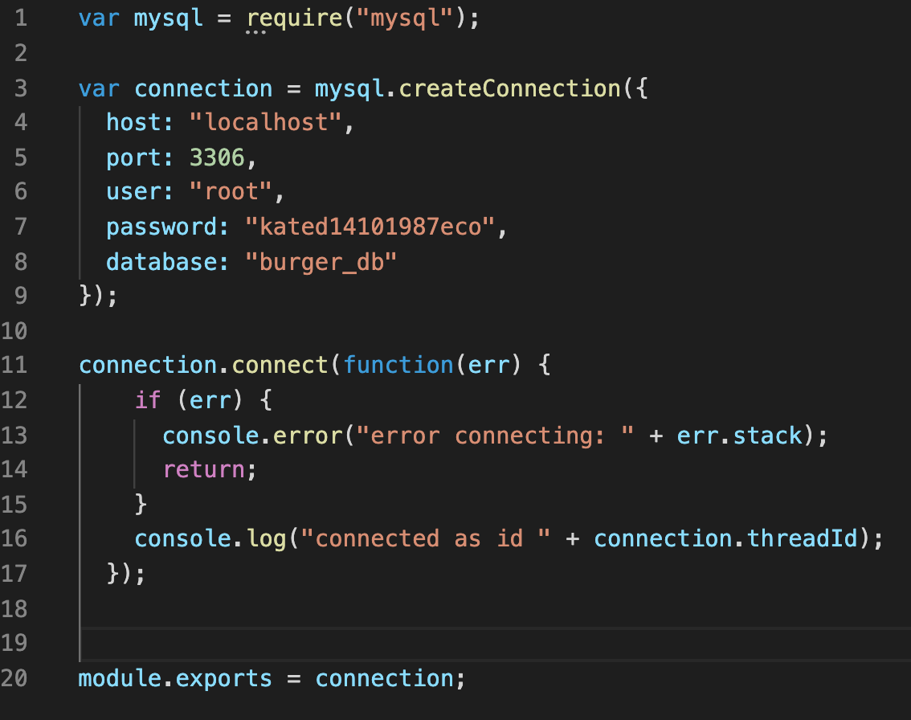
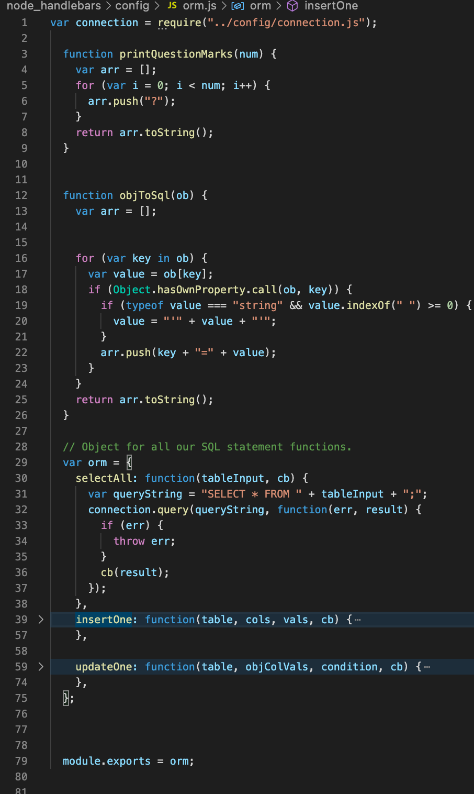
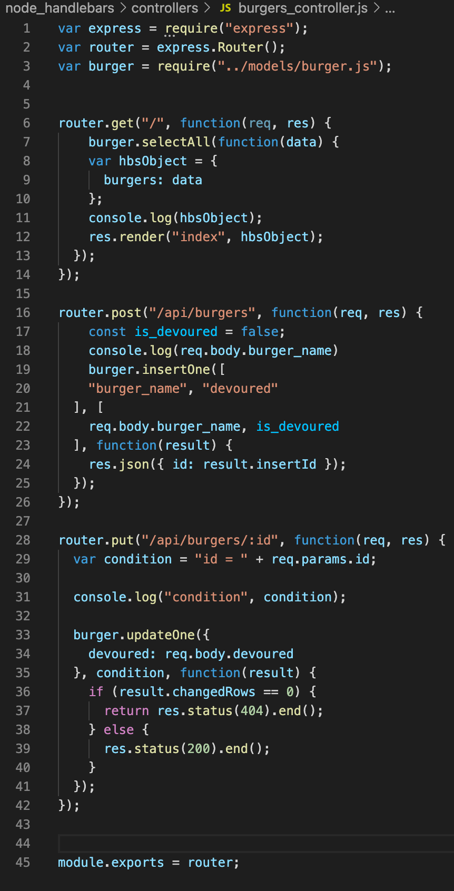
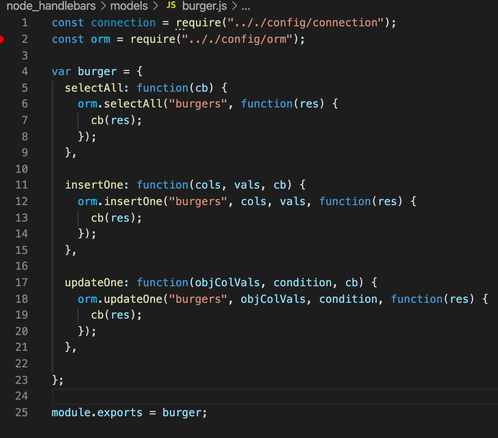
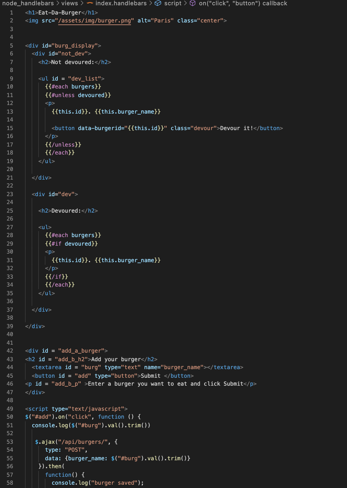
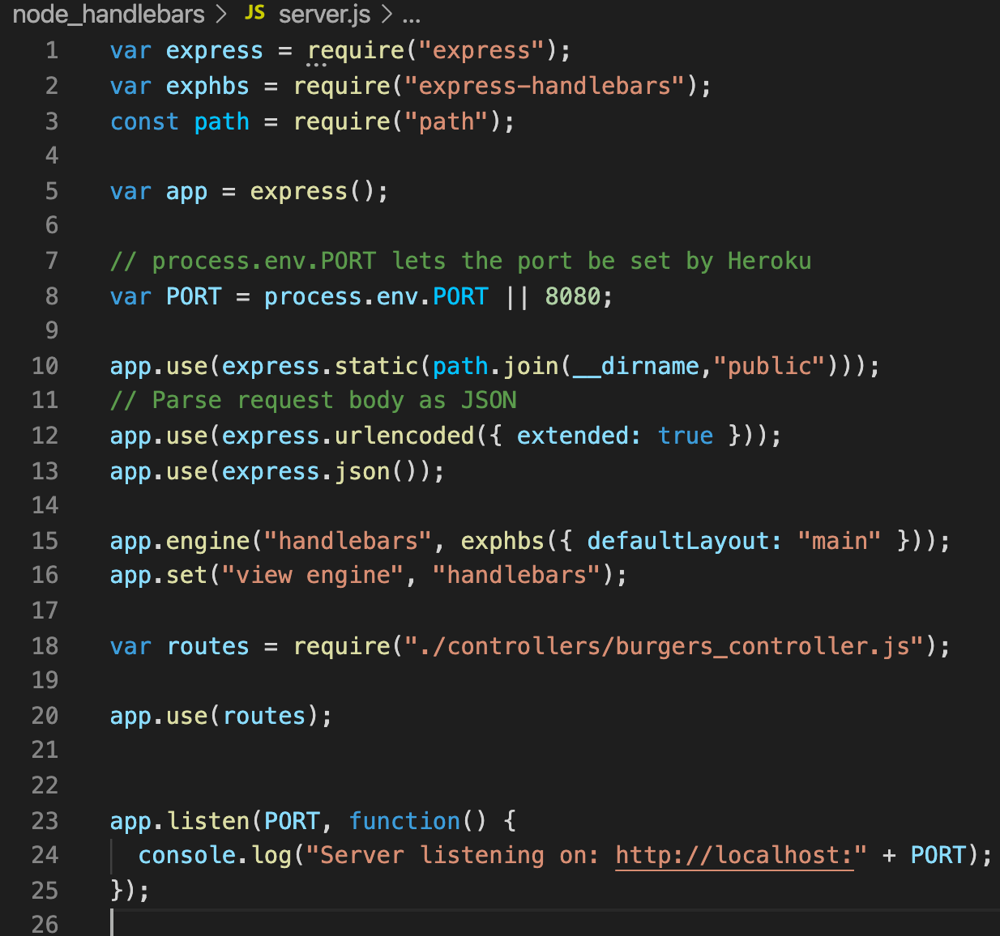

# Node Handlebars 

## Table of Contents
1. [ Description ](#desc)
2. [ Task ](#task)
3. [ Link to Heroku deployment ](#link)
4. [ Structure ](#structure)
5. [ Finished product ](#final)
6. [ Contact details ](#contact)

## 1. Description
This repository contains code for the burger logger with MySQL, Node, Express, Handlebars and a homemade ORM. The application structure follows the MVC design pattern. Node and MySQL were used to query and route data in the app, and Handlebars to generate HTML page.  

## 2. Task
Task is to build restaurant app that lets users input the names of burgers they'd like to eat.
Whenever a user submits a burger's name, the app displays the burger on the left side of the page - waiting to be devoured. Each burger in the waiting area also has a Devour it! button. When the user clicks it, the burger will move to the right side of the page. The app stores every burger in a database, whether devoured or not.

The app contains three main routes: GET - displays all the burgers from the database , POST - stores a newly created burger to the database, PUT - updates the status of each burger from not devoured to devoured. 

## 3. Link to Heroku deployment 
The project is deployed on Heroku and available for view using this link:
https://node-handlebars-heroku-kat.herokuapp.com/

## 4. Structure
The structure of the repo is presented in the image below:
.
Config folder contains *connection.js* and *orm.js*. 
*Connection.js* has the code needed to establish connection to a database.
.
*orm.js* defines CRUD methods.
.
Controllers folder contains *burger-controller.js* which establishes server routes:
.
Models folder contains *burger.js* which connects the developed CRUD methods with the server routes:
.
Views and public folder contains the frontend part of the application such as handlebars, stylesheet and front-end javascript.
.
*Server.js* that is located in the root folder stores all the dependensies and connects to the port.
.

## 5. Finished product
The final HTML page looks like this:

## 6. Contact details
If you have any questions, contact me via email: 

